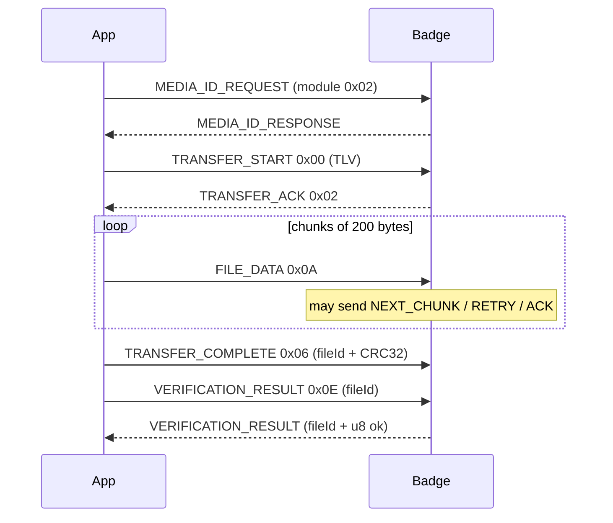

# File transfer module (`0x01`)

Chunked upload of images, video, animation, and related assets. Maximum file size **10 MiB**. Chunk data size **200** bytes.

## Commands

| Name | ID |
|------|----|
| `TRANSFER_START` | `0x00` |
| `TRANSFER_STOP` | `0x01` |
| `TRANSFER_ACK` | `0x02` |
| `TRANSFER_NACK` | `0x03` |
| `NEXT_CHUNK_REQUEST` | `0x04` |
| `RETRY_REQUEST` | `0x05` |
| `TRANSFER_COMPLETE` | `0x06` |
| `FILE_DATA` | `0x0A` |
| `STATUS` | `0x0B` |
| `RECEIVED_CHECKSUM` | `0x0C` |
| `TOTAL_TRANSFERRED` | `0x0D` |
| `VERIFICATION_RESULT` | `0x0E` |

## Types

### FileType

| Name | Value |
|------|------:|
| `IMAGE` | 1 |
| `VIDEO` | 2 |
| `ANIMATION` | 3 |
| `MULTI_FILE` | −1 (`0xFF`) |

### FunctionType

See [Media](media.md) — `BACKGROUND` / `STICKER` / `FONT` / `PREVIEW`.

### TransferStatus (`STATUS` response)

| Name | Value |
|------|------:|
| `IDLE` | 0 |
| `PREPARING` | 1 |
| `TRANSFERRING` | 2 |
| `PAUSED` | 3 |
| `COMPLETED` | 4 |
| `FAILED` | 5 |
| `CANCELLED` | 6 |

## Happy-path sequence



## Payloads

### TRANSFER_START (app TX TLV)

Built by `FileTransferService.buildFileInfoPayload` — **14 bytes**:

| Offset | Content |
|--------|---------|
| 0 | tag `0x07` |
| 1–4 | `fileSize` u32 BE |
| 5 | tag `0x08` |
| 6 | `fileType` |
| 7 | tag `0x0A` |
| 8 | `functionType` |
| 9 | tag `0x09` |
| 10–13 | `mediaId` u32 BE |

### TRANSFER_ACK

```
u64 fileId [ | u32 chunkIndex ]
```

Use the `fileId` returned by the device for subsequent chunks when present.

### TRANSFER_NACK

```
u64 fileId | u32 errorCode | message UTF-8
```

### NEXT_CHUNK / RETRY

```
u64 fileId | u32 chunkIndex
```

### FILE_DATA

```
u64 fileId | u32 chunkIndex | u32 chunkSize | u8 isLast | data[chunkSize]
```

- `chunkSize` is the length of `data` (≤ 200).
- `isLast` is non-zero on the final chunk.
- Header before data is **17** bytes.

### TRANSFER_COMPLETE

```
u64 fileId | u32 crc32
```

### VERIFICATION_RESULT

| Side | Payload |
|------|---------|
| Request (len 8) | `u64 fileId` |
| Response (len 9) | `u64 fileId \| u8 result` (`1` = OK) |

### STATUS

| Side | Payload |
|------|---------|
| Query | empty |
| Response | `u8 TransferStatus` |

### TRANSFER_STOP

App may send `u64 fileId` (console does this).

## CRC32

Algorithm: standard IEEE / `java.util.zip.CRC32`

- Polynomial `0xEDB88320`
- Init `0xFFFFFFFF`
- Reflected
- Final XOR `0xFFFFFFFF`
- Carried on the wire as **big-endian u32** (low 32 bits of the value)

Computed over the **entire file body**, not per chunk.

## Timing / retries (app defaults)

| Constant | Value |
|----------|------:|
| Transfer timeout | 30 000 ms |
| Default command timeout | 5 000 ms |
| Max retries | 3 |
| Retry delay | 1 000 ms |

## Web console

**Transfer** tab: choose file → file type / function → optional auto media-ID → **Push file**. Progress bar tracks chunk sends; wire log shows each frame.

## Related

- [Media](media.md)
- [Error codes](commands.md#error-codes)
- [Examples](examples.md)
