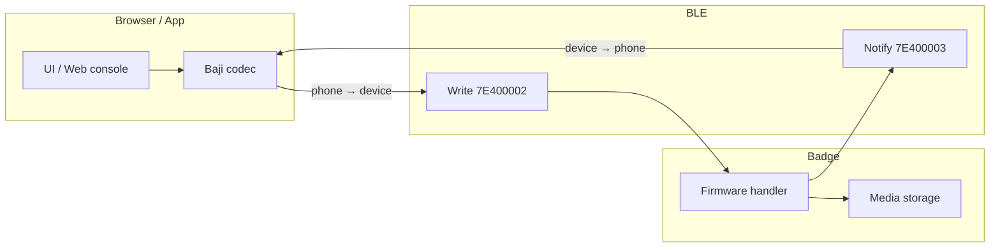

# Protocol overview

SuperBand’s badge features speak the **Baji** application protocol over a **UART-style BLE GATT** service from the MyWatch SDK.

## Layers

| Layer | Responsibility |
|-------|----------------|
| Advertising | Manufacturer `0xAA01`, device type `3`, optional `_Vn_BadgeOK` name |
| GATT | Nordic-like UART: one write char, one notify char |
| Framing | `0xCD` packets; Baji uses product ID `0x25` at offset 3 |
| Modules | System info, media management, file transfer |
| Legacy | Older MyWatch frames on the same UART (pairing, watch cmds) |

## Connection sequence

1. Scan — see [Discovery](discovery.md)
2. Connect GATT and discover service `7E400001-…`
3. Enable notifications on `7E400003`
4. Write legacy pair frame `CD 00 06 12 01 0A 00 01 02`
5. Negotiate large MTU (app requests 512; Web Bluetooth negotiates automatically)
6. Send Baji `SYSTEM` / `DEVICE_INFO_REQUEST`
7. For uploads: allocate media ID → transfer chunks → CRC verify — see [File transfer](file-transfer.md)

## Discriminating traffic

| `byte[0]` | `byte[3]` | Meaning |
|-----------|-----------|---------|
| `0xCD` | `0x25` | Baji frame |
| `0xCD` | other | Legacy MyWatch-style frame (module key at `[3]`) |

## Implementation map

| Concern | Android reference client | Web client (`web/`) |
|---------|----------------------|---------------------|
| Frame build/parse | `com.baji.protocol.utils.ProtocolEncoder` | `web/js/protocol.js` |
| Orchestration | `BajiProtocolManager` | `web/js/client.js` (`SuperBandClient`) |
| GATT write/notify | MyWatch SDK bluetooth layer | `web/js/ble.js` |
| Transfer | `FileTransferService` | `SuperBandClient.transferFile()` |
| Management UI | DeviceHome / PicturePush | `web/index.html` + `web/js/app.js` |

## Related docs

- [GATT](gatt.md) · [Framing](framing.md) · [Commands](commands.md) · [Examples](examples.md)
